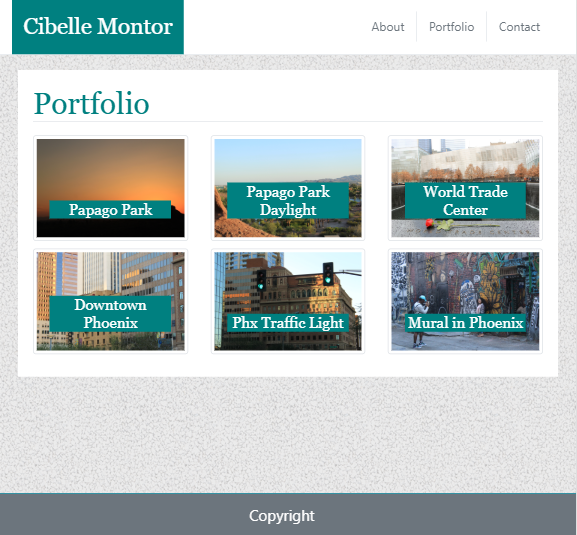
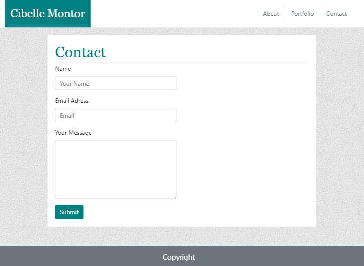

# responsiveportfolio 

Responsive Portfolio built with Boostrap's grid system (containers, rows, and columns).   
I recreated 3 pages: index.html, portfolio.html and contact.html.  All pages were developed to be seen in screens with diferent sizes, including very small screens. 
In the portfolio page I added some personal shots and they were all positioned  using the grid system. In each image, I added a carousel caption.

**Key words**: 
    *Boostrap*,
    *Grid System*,
    *Containers*,
    *Rows*,
    *Columns*,
    *Caroussel*,
    *Nav bar*.

Below are some screenshots on how the website it's going to look: 

  
  
  

